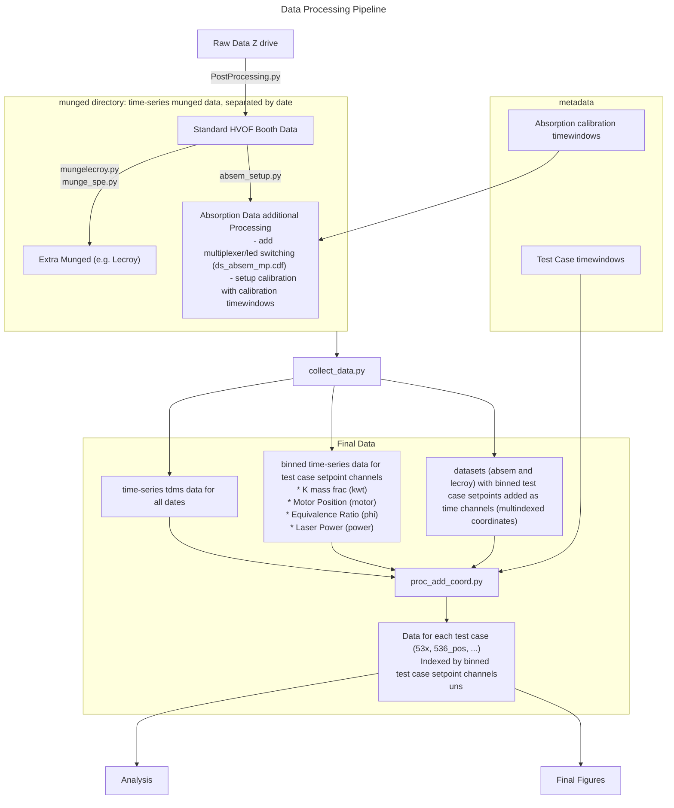

# Data processing

```mermaid

---
title: Data Processing Pipeline
---

flowchart TD;


    direction TB

    subgraph munged ["munged directory: time-series munged data, separated by date"]
        M1[Standard HVOF Booth Data]
        M2["Extra Munged (e.g. Lecroy)"]
        M3["
        Absorption Data additional Processing
            - add multiplexer/led switching (ds_absem_mp.cdf) 
            - setup calibration with calibration timewindows
        "]

    end

    subgraph "metadata"
        direction TB
        MD1["Absorption calibration timewindows"]
        MD3["Test Case timewindows"]
        MD1 ~~~ MD3
        
    end

    subgraph final ["Final Data"]
        FD1["time-series tdms data for all dates"]
        FD2["`
        binned time-series data for test case setpoint channels
        * K mass frac (kwt)
        * Motor Position (motor)
        * Equivalence Ratio (phi)
        * Laser Power (power)
        `"]
        FD3["`
        datasets (absem and lecroy) with binned test case setpoints added as time channels (multindexed coordinates)
        `"]
        
        FD4["
        Data for each test case (53x, 536_pos, ...)
        Indexed by binned test case setpoint channels
        uns
        "]
        FD1 --> proc_add_coord.py 
        FD2 --> proc_add_coord.py 
        FD3 --> proc_add_coord.py 
        proc_add_coord.py --> FD4


    end


    RD[Raw Data Z drive] 
    RD -- PostProcessing.py --> M1
    M1 --" 
        mungelecroy.py 
        munge_spe.py
        "
    --> M2
    M1 -- absem_setup.py --> M3
    MD1 --> M3

    munged ---> collect_data.py
    collect_data.py ---> FD1
    collect_data.py ---> FD2
    collect_data.py ---> FD3

    MD3 --> proc_add_coord.py

    FD4 ---> A["`
    Analysis
    `"]

    FD4 ---> Fig["`
    Final Figures
    `"]

```